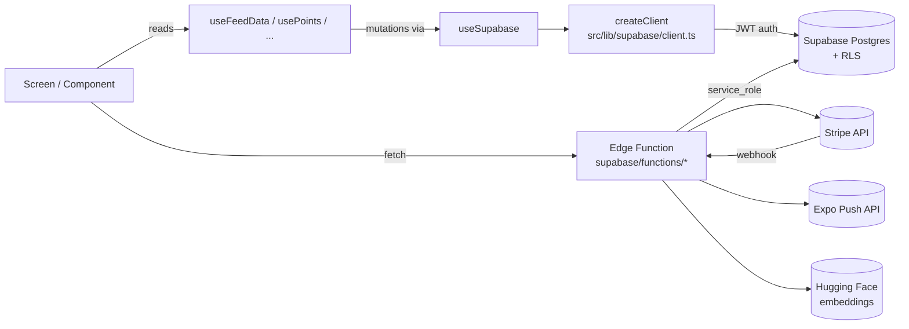
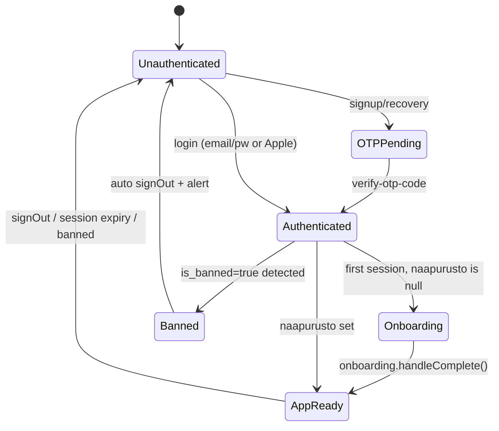

# TackBird Mobile — Architecture

High-level overview of how the app is wired together. Kept short and accurate — prefer linking to code over restating it.

## Stack

| Layer | Technology |
|---|---|
| App framework | Expo SDK 54 + Expo Router (file-based) |
| Language | TypeScript strict |
| Styling | `StyleSheet.create` (no NativeWind/Tailwind) + Helsinki Dusk design tokens in `useTheme` |
| Backend | Supabase (Postgres + Auth + Storage + Realtime + Edge Functions) |
| Payments | Stripe Checkout + Stripe Connect (via Edge Functions) |
| Email | Resend API (via Edge Functions) |
| Push notifications | Expo Push Notifications API (via Edge Function `send-push`) |
| Monitoring | Sentry (optional, no-op in `__DEV__`) |
| i18n | Custom `I18nProvider` in `src/lib/i18n/` — fi / en / sv |
| Distribution | Expo Go for dev, EAS Build for production |

## Directory layout

```
app/                      # Expo Router screens (file → route)
  (tabs)/                 # Bottom tab navigator: feed, explore, create, messages, profile
  (auth)/login.tsx        # Login/register/forgot password
  post/[id].tsx           # Post detail (+ booking modals)
  messages/[id].tsx       # 1:1 conversation
  event-chat/[id].tsx     # Group chat for community events
  groups/[id].tsx         # Group detail
  profile/[userId].tsx    # Public profile
  booking/[id].tsx        # Booking detail (+ status actions)
  settings.tsx            # Profile settings, notifications, GDPR export/delete
  admin.tsx               # Admin panel (behind is_admin flag)
  _layout.tsx             # Root providers + auth guards + stack config
src/
  hooks/                  # 34 custom hooks — see "Hooks" below
  components/             # Shared UI (Avatar, PostCard, FilterBar, map/, forum/, groups/)
  lib/
    supabase/client.ts    # Singleton Supabase client (createClient())
    i18n/                 # Translations (fi/en/sv) + useI18n provider
    format.ts             # Intl-cached time/price/date formatters
    feedAlgorithm.ts      # Client-side ranking for the feed
    haptics.ts            # hapticMedium + withHapticRefresh (only what's used)
    analytics.ts          # Event tracking + retention + offline queue
    constants.ts          # Trust tiers, categories, colors
supabase/
  functions/              # 24 Edge Functions (see "Edge Functions" below)
  migrations/             # SQL migrations (date-prefixed)
```

## Data flow



**Rules:**
- All reads/writes go through `useSupabase()` — a `useMemo`-stable singleton wrapper around `createClient()`. **Never** instantiate Supabase clients in components.
- Privileged operations (auth.admin API, service_role mutations, cross-user updates) must live in Edge Functions — never in the client.
- RLS is the primary security boundary. Treat client-side checks as UX hints only.

## Critical dependencies (blast radius)

Measured via `gitnexus impact`:

| Symbol | Upstream impact | Risk |
|---|---|---|
| `createClient` (lib/supabase/client.ts) | **121 symbols** / 61 processes / 10 modules | CRITICAL |
| `useSupabase` | 76 symbols / 56 processes / 9 modules | CRITICAL |
| `useTheme` | 109 callers | CRITICAL |

These three together touch every screen. If they break, the app is down. Change with care and always add tests.

## Most-queried Supabase tables

| Table | Queries from code |
|---|---|
| `profiles` | 22 |
| `posts` | 16 |
| `user_follows` | 6 |
| `saved_posts` | 6 |
| `user_badges` | 5 |
| `reviews` | 5 |
| `post_likes` | 5 |
| `notifications` | 4 |
| `messages` | 4 |

`profiles` is the pivot table for the whole system (user data + naapurusto + trust flags + Stripe IDs).

## Hooks

34 custom hooks in `src/hooks/`. The important ones:

| Hook | Purpose |
|---|---|
| `useSupabase` | Memoized singleton client — always use this |
| `useTheme` | Light/dark/system theme + Helsinki Dusk tokens |
| `useI18n` | Translations + locale switching |
| `useFeedData` | Orchestrates the home feed (posts, ranking, location, community cards) |
| `useFeedData` internal refs | Uses `fetchPostsRef`, `focusCountRef`, `debounceRef` to avoid stale closures |
| `useTrustLevel` | 5-min in-memory cached trust score + tier + next-tier hints |
| `useStripePayment` | Creates Stripe Checkout sessions via `stripe-checkout` Edge Function |
| `useBoosts` | Boost balance + purchase via `verify-boost-purchase` + activate via `use-boost` |
| `usePushNotifications` | Expo push token lifecycle, AppState-based rotation, token sync to profiles |
| `useUnreadCount` + `useEventChatUnread` | Realtime-backed unread counters; aggregated in `app/(tabs)/_layout.tsx` for the app badge |
| `usePresence` | Supabase Realtime presence channel per neighborhood |
| `useStreak` | AsyncStorage-cached daily streak tracker |
| `useReferral` | Invite code generation + apply flow + tier unlocks |
| `useNotificationPreferences` | Opt-in/out per push type, cached locally |
| `useGlobalErrorRecovery` | Unhandled rejection handler → Sentry |
| `useAppStateManager` | Disconnect Supabase realtime on background, reconnect on foreground |
| `useMemoryWarning` | iOS memory pressure → clear expo-image cache |

Hooks follow a stable `mounted` + `abortController` cancel pattern for async side effects. StrictMode-safe setState updaters are required — never call `AsyncStorage.setItem` inside a `setState` updater (use a ref).

## Edge Functions

24 functions in `supabase/functions/`, all deployed to project `wfsghkseyyxkkalcqtzq`:

| Function | Purpose | Auth |
|---|---|---|
| `admin-api` | Dashboard stats, ban/unban, report review, audit log | admin JWT |
| `auth-verify` | Email verification redirect → `tackbird://auth/callback` | none (public redirect) |
| `db-backup` | Daily JSON export of critical tables → Storage bucket | cron secret |
| `delete-account` | GDPR erasure: clean 25 tables + `auth.admin.deleteUser()` | user JWT |
| `embed-post` | Generate 384-dim text embedding via HuggingFace → `post_embeddings` | user JWT (ownership checked) |
| `grant-tier-boosts` | Monthly cron: grant 2 boost credits to Pro, 5 to Business | cron secret or admin JWT |
| `health-check` | DB + Storage + Auth liveness for uptime monitoring | none |
| `moderate-content` | Regex + HuggingFace NSFW scan → `content_flags` → auto-hide on block | user JWT |
| `price-suggestion` | Neighborhood + tag-matched median price for services/rentals | user JWT |
| `pro-subscribe` | Create Stripe subscription Checkout (monthly/yearly/business) | user JWT |
| `semantic-match` + `semantic-search` | pgvector cosine similarity via `match_posts` RPC | user JWT |
| `send-digest` | Weekly cron: per-neighborhood activity summary via Resend | cron secret |
| `send-email` | Transactional email templates via Resend | user JWT |
| `send-otp` + `verify-otp-code` | 6-digit code signup + recovery via Resend | anon apikey + rate-limited |
| `send-push` | Expo Push Notifications — urgent broadcast, batching, quiet hours, token cleanup | user JWT |
| `stripe-checkout` | Create Checkout Session for rental / service / ad_campaign with 10% (Pro: 5%) commission | user JWT |
| `stripe-connect-onboard` | Stripe Connect Express account creation for providers | user JWT |
| `stripe-webhook` | Handles `checkout.session.completed`, `subscription.*`, `charge.refunded` | Stripe signature |
| `ticketmaster-proxy` | Server-side proxy for Ticketmaster Discovery API (keeps key secret) | none (rate-limited via cache) |
| `use-boost` | Atomic balance decrement + post_boost insertion | user JWT |
| `validate-business` | PRH (Finnish business registry) lookup by Y-tunnus | user JWT |
| `verify-boost-purchase` | Apple IAP / Android / sandbox receipt verification | user JWT |

## Security model

**Row-Level Security (RLS) is the primary boundary.** Every table has RLS enabled; policies restrict reads/writes to the row owner except for public read on posts/profiles.

Four critical RLS holes were fixed in `migrations/20260410_rls_security_holes.sql`:

1. **`user_badges`** — was `auth.uid() IS NOT NULL`, now `auth.role() = 'service_role'`. Prevents self-verification badge planting.
2. **`trust_scores`** — same tightening. Prevents trust score forgery.
3. **`user_points`** — now requires `user_id = auth.uid() AND points >= 0`. Prevents awarding points to other users or draining balances.
4. **`post_embeddings`** — INSERT/UPDATE requires ownership of the referenced post. Prevents semantic match poisoning.

**Auth state machine:**



Session guards live in `app/_layout.tsx`:
- `useAuthStateListener` — handles SIGNED_IN / SIGNED_OUT / TOKEN_REFRESHED / PASSWORD_RECOVERY events
- `useSessionGuard` — 60s interval check on protected routes
- `useOnboardingGuard` — redirects to `/onboarding` if profile has no `naapurusto`

## Realtime

Supabase Realtime is used for:

| Channel | Subscribers |
|---|---|
| `feed-new-posts` | Feed screen — badges "X new posts" |
| `unread-badge-{userId}` | App icon badge (1:1 conversations) |
| `event-chat-unread-{userId}` | App icon badge (event group chats) |
| `conv-{id}` | Conversation screen — new message insert |
| `event-chat-{id}` | Event chat screen — new message insert |
| `messages-list-{userId}` | Messages tab — refresh on new inbound |
| `group_posts_realtime_{id}` | Group detail — new post banner |
| `presence:{neighborhood}` | Presence count on feed header |

**`useAppStateManager`** disconnects realtime on background and reconnects on foreground — critical for battery on mobile.

## i18n

Three locales in `src/lib/i18n/`: `fi.json`, `en.json`, `sv.json`. Auto-detection based on GPS country (via `useLocationDetection` → Nominatim reverse-geocode). User can override in settings.

Finnish is the primary locale and must never have missing keys — en/sv may have fallbacks to fi.

## Build & deploy

```bash
npx tsc --noEmit                       # type check (run before every commit)
npx expo start                         # dev server (Expo Go)
npx expo start --web                   # web preview
SUPABASE_ACCESS_TOKEN=... npx supabase functions deploy <name> --project-ref wfsghkseyyxkkalcqtzq
```

Migrations are applied manually via Supabase Dashboard SQL Editor when the migration history has drifted.

## See also

- [Authentication flow](flows/authentication.md)
- [Payment flow](flows/payment.md)
- [Post creation flow](flows/post-creation.md)
- [Messaging flow](flows/messaging.md)
- [Content moderation flow](flows/moderation.md)
- [Account deletion (GDPR)](flows/account-deletion.md)
- [Push notification flow](flows/push-notifications.md)
