---
pdf_options:
  format: A4
  margin: 25mm 20mm 25mm 20mm
  printBackground: true
  displayHeaderFooter: true
  headerTemplate: '
TackBird — UI Record | Puddles Oy
'
  footerTemplate: '
 / 
'
stylesheet: []
body_class: tackbird-doc
---

# TackBird

<strong>UI Record — Forum Virium Helsinki</strong>

Puddles Oy (Y-tunnus 3610705-3) | Huhtikuu 2026 | Versio 1.0.0

---

## Yleiskuvaus

**TackBird on hyperlokaalinen naapurustosovellus Helsinkiin.** Se yhdistaa ilmoitustaulun, vertaislainauksen, yhteisotapahtumat, taloyhtion hallinnon ja luottamusjarjestelman yhteen mobiilisovellukseen — kaikki rajattu kavelymatkalle.

> *"TackBird on naapurustosi oma ilmoitustaulu — loyda, lainaa ja jaa lahella, turvallisesti."*

**Ongelma:** Suomalaiset naapurustot ovat digitaalisesti hajanaisia. Tori.fi on kaupunkitasoinen ja persoonaton. Facebook-ryhmat ovat rakenteettomia. Taloyhtion WhatsApp-ryhmat ovat kaoottisia. Mikaan ei tarjoa rakenteellista vertaislainausta vakuuksineen ja arvioinnein.

**Ratkaisu:** TackBird tuo naapuruston oman ilmoitustaulun — viisi sisaltokategoriaa, luottamusjarjestelma, taloyhtiohallinto ja turvallinen viestinta yhdessa paikassa.

**Kohdealue:** Kallio, Helsinki (beachhead) → rakennus kerrallaan → koko Helsinki

  

    
48

    
Nayttoa

  

  

    
31

    
Edge Functions

  

  

    
67

    
DB-taulua

  

  

    
211

    
RLS-politiikkaa

  

  

    
3

    
Kielta (fi/en/sv)

  

  

    
5

    
Kategoriaa

  

---

## Teknologiapino

| Kerros | Teknologia |
|--------|-----------|
| Framework | Expo SDK 54 + Expo Router (tiedostopohjainen navigaatio) |
| Kieli | TypeScript (strict mode) |
| UI | React Native + StyleSheet.create + Lucide React Native (ikonit) |
| Backend | Supabase (PostgreSQL, Auth, Storage, Realtime, Edge Functions) |
| Autentikaatio | Supabase Auth + SecureStore (JWT-sessiot) |
| Kuvat | expo-image (optimoitu renderaus) + expo-image-picker |
| Animaatiot | react-native-reanimated |
| Lokalisaatio | Rakennettu I18nProvider (fi/en/sv) |
| Maksaminen | Stripe Connect + Checkout (aktivointi tulossa) |
| Jakelu | EAS Build (iOS + Android natiivibinaarit) |

---

## Design-jarjestelma: Helsinki Monochrome v3

### Filosofia

Helsinki Monochrome v3 on **ink-on-warm-neutral** -designjarjestelma. Kayttoliittyma pysyy rauhallisen monokromaattisena — sisalto tuo varit kategoriakohtaisesti. Kaikki kontrastit tayttavat WCAG AA -vaatimukset.

### Typografia

| Rooli | Fontti | Kaytto |
|-------|--------|--------|
| Display / Otsikot | **Bricolage Grotesque** | Nayttojen nimet, suuret otsikot |
| Body / UI | **Instrument Sans** | Leipateksti, painikkeet, labelit, meta |

Tyyppiasteikko: 12 / 13 / 14 / 16 / 18 / 20 / 24 / 28 / 32 px

### Varipaletti — Light Mode

| Token | Vari | Kaytto |
|-------|------|--------|
| Primary |  `#1A1D1F` | Ink — paateksti, CTA-painikkeet |
| Background |  `#F5F6F7` | Lammin neutraali pohja |
| Card |  `#FFFFFF` | Korttipinnat |
| Border |  `#E8EAEC` | Hienot erottimet |
| Muted text |  `#535A60` | Meta, kuvatekstit (AA 4.6:1) |
| Destructive |  `#C44536` | Varoitukset |
| Success |  `#2D7A4F` | Onnistumiset |

### Varipaletti — Dark Mode

| Token | Vari | Kaytto |
|-------|------|--------|
| Primary |  `#F5F6F7` | Kaanteinen ink |
| Background |  `#0E1012` | Tumma pohja |
| Card |  `#17191C` | Tumma korttipinta |
| Border |  `#2E3136` | Tumma erotin |
| Muted text |  `#8B8F94` | Tumma meta (AA 5.4:1) |

### Kategoriavarit

| Kategoria | Light | Dark | Vari |
|-----------|-------|------|------|
| **Tarvitsen** |  `#C75B3A` |  `#D4734F` | Oranssinpunainen |
| **Tarjoan** |  `#7C5CBF` |  `#9B7DD4` | Violetti |
| **Ilmaista** |  `#3B7DD8` |  `#5B9BF0` | Sininen |
| **Lainaa** |  `#A97A1E` |  `#C99A3E` | Kulta |
| **Tapahtuma** |  `#2B8A62` |  `#3AAE7A` | Vihrea |

### Muut designtokenit

| Token | Arvo |
|-------|------|
| Kortin pyoristys | 16px |
| Painikkeen pyoristys | 28px (pill) |
| Chippien pyoristys | 20px |
| Kosketusalueen minimi | 44 x 44 pt |
| Valilyontirytmi | 4/8dp-jarjestelma |

---

## Kayttoliittyma — Ydinnaytot

### Koti (Feed)

Naapuruston syote alykkaan algoritmin karjistyksella, kategoriachipseilla ja kahdella layouttinakymalla.

  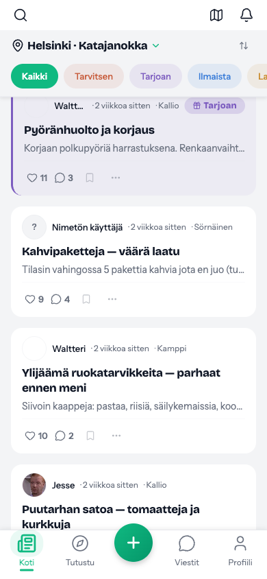
  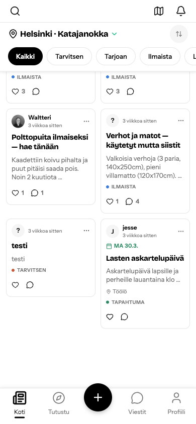

Vasemmalla: Listanahkuma kategoriachipseilla. Oikealla: 2-sarakkeinen ruudukkonahkuma.

**Ominaisuudet:**
- Sijaintivalitsin (naapurusto-dropdown)
- Kategoriachipsit: Kaikki | Tarvitsen | Tarjoan | Ilmaista | Lainaa | Tapahtuma
- Lajitteluvalinnat: Tuoreus / Suosituin / Lahin
- Kuva- ja tekstikorttivariantit
- Tapahtumanostot varikoodatulla taustalla
- Reaaliaikapaivitys (tykkays- ja kommenttilaskurit)
- 7-tekijainen feed-algoritmi

### Ilmoituksen luominen

2-vaiheinen prosessi: ensin kategoriavalinta, sitten lomake.

  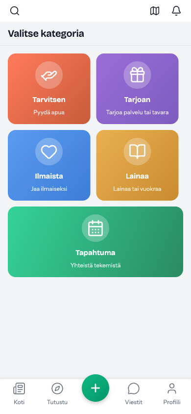
  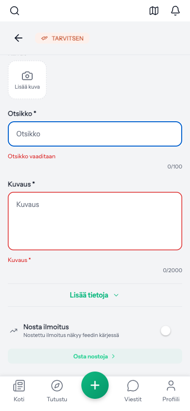

Vasemmalla: Bento-kategoriavalitsin. Oikealla: Lomake inline-validaatiolla.

**5 kategoriaa:**
- TARVITSEN Pyyda apua naapureilta
- TARJOAN Tarjoa palvelu tai tavara
- ILMAISTA Jaa ilmaiseksi
- LAINAA Lainaa tai vuokraa
- TAPAHTUMA Luo yhteisotapahtuma

---

### Viestit, ilmoitukset ja profiili

  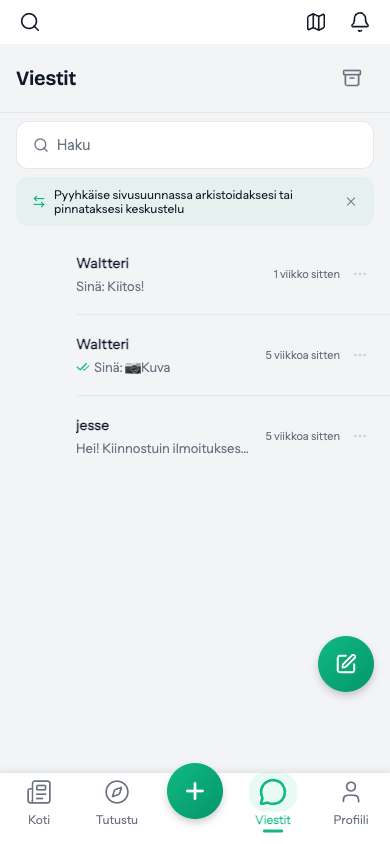
  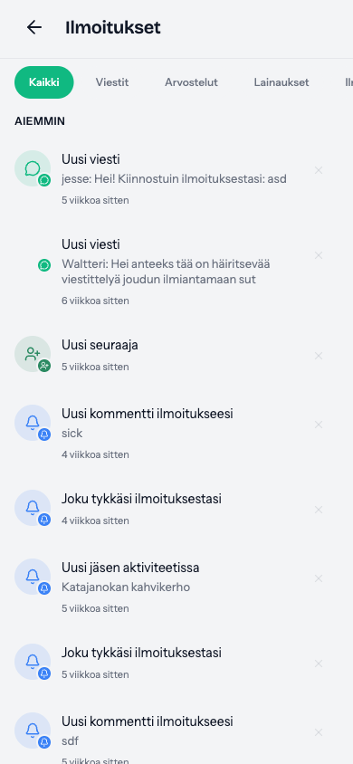
  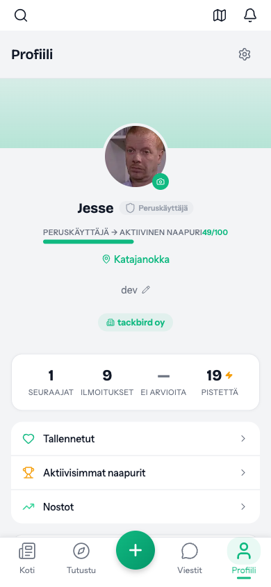

Vasemmalta: Viestilista pyyhkaisyvihjeella. Ilmoituskeskus suodattimilla. Profiili luottamustason edistymispalkilla.

**Viestit:**
- Kahdenvalinen viestinta kuvatuella
- Pyyhkaisyeleet: arkistointi ja pinnaus
- Kirjoitusindikaattori ja lukukuittaukset
- Uusi viesti -FAB

**Ilmoitukset:**
- Suodatinvaliletea: Kaikki | Viestit | Arvostelut | Lainaukset
- Aikaryhmat: Tanaan, Aiemmin, Tama viikko
- Ilmoitustyypit: viestit, seuraajat, kommentit, tykkaysset

**Profiili:**
- Edistymispalkki seuraavaan luottamustasoon
- Tilastot: seuraajat, ilmoitukset, arviot, pisteet
- Naapurusto- ja taloyhtiolinkki

### Tutustu ja haku

  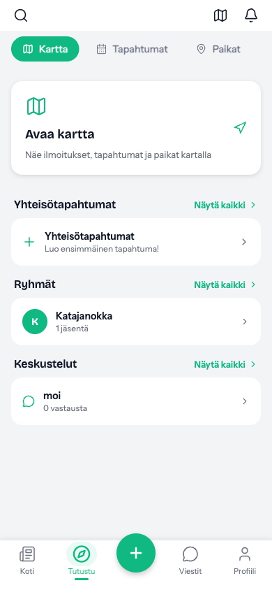
  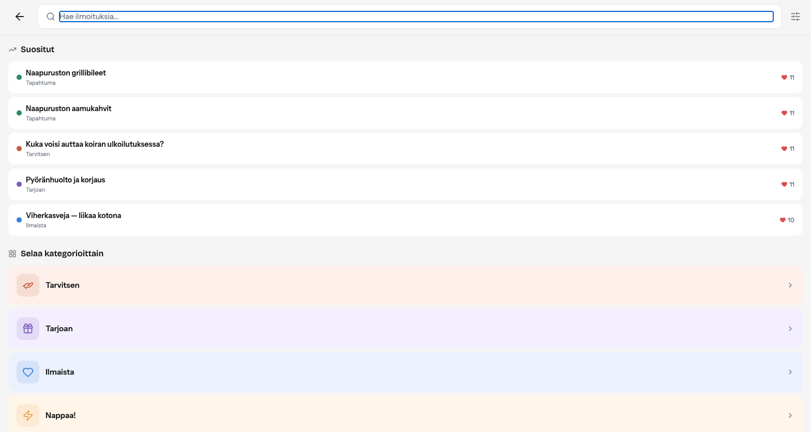

Vasemmalla: Tutustu-nakyma (kartta, tapahtumat, ryhmat, keskustelut). Oikealla: Haku suosituilla hakutermeilla ja kategoriaselaus.

---

### Ilmoituksen yksityiskohdat ja onboarding

  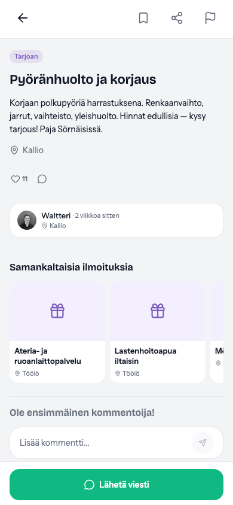
  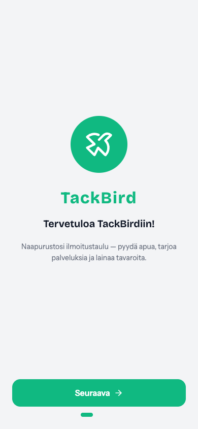

Vasemmalla: Ilmoituksen yksityiskohdat (kategorialeima, julkaisijan kortti, samankaltaiset ilmoitukset, kommenttiosio). Oikealla: Tervetulonayto.

**Ilmoituksen yksityiskohdat:**
- Tallenna, jaa, ilmianna -toimintopalkki
- Kategorialeima varikoodattuna
- Julkaisijan profiilikortti (avatar, nimi, naapurusto)
- "Samankaltaisia ilmoituksia" -karuselli
- Kommenttiosio
- "Laheta viesti" -CTA

**Onboarding (4 vaihetta):**
1. Tervetuloa TackBirdiin — logo ja slogan
2. Naapuruston valinta — osoitepohjainen paikannus
3. Tarkoituksen valinta — mita etsit sovelluksesta
4. Talon liittyminen — taloyhtiolinkki

### Asetukset

  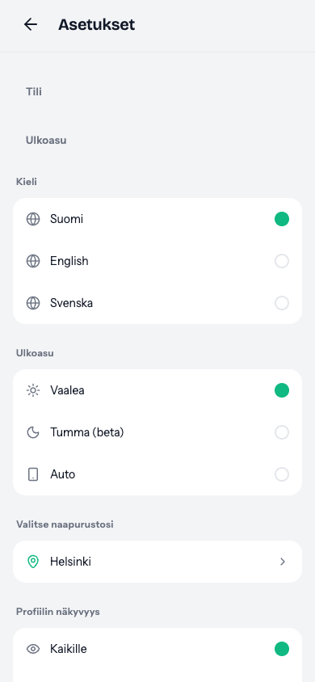

Asetukset: kielivalinta (fi/en/sv), teema (vaalea/tumma/auto), naapuruston valinta, profiilin nakyvyys.

---

### Dark Mode

  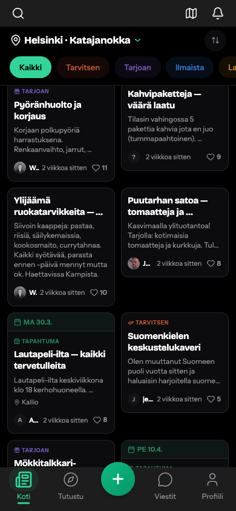

Feed dark modessa — 2-sarakkeinen ruudukko. Kategoriavarit optimoitu WCAG AA -kontrastille tummaa pintaa vasten.

---

## Luottamusjarjestelma

TackBird kayttaa 3-portaista progressiivista luottamusjarjestelmaa, joka mahdollistaa turvallisen vertaiskaupan.

| Taso | Nimi | Vaatimukset | Oikeudet |
|------|------|-------------|----------|
| **1** | Peruskäyttäjä | Sahkopostin vahvistus | Lainaus (max 50eur/pv), perusominaisuudet |
| **2** | Aktiivinen naapuri | +ID-vahvistus, 7pv tilika | Maksulliset palvelut (max 200eur) |
| **3** | Luotettu naapuri | +3 arvostelua (ka 4.0+), 90% vastausprosentti, 30pv | Rajoittamaton, feedin prioriteetti, merkki |

Edistyminen visualisoidaan profiilissa palkilla ja pisteyttajalla (esim. "49/100").

---

## Taloyhtiohallinto

Taloyhtion digitaalinen hallinta on yksi TackBirdin strategisista erottautumistekijoista. Kun tiedotteet, huoltopyyntohistoria ja jasenhakemisto asuvat TackBirdissa, vaihtokulut ovat korkeat.

### Ominaisuudet

| Ominaisuus | Kuvaus |
|------------|--------|
| **Tiedotteet** | Viralliset rakennuksen tiedotteet pikajakelulla |
| **Huoltopyynnot** | Ilmoita ja seuraa huoltotarpeita tilanpaivityksin |
| **Jasenluettelo** | Nae rakennuksen asukkaat ja profiilit |
| **Jarjestyssaannot** | Taloyhtion saannot ja ohjeet |
| **Rakennuksen chat** | Reaaliaikainen keskustelu asukkaiden kesken |

### Strateginen merkitys

- **Taloyhtion hallitus** on luonnollinen adoptiokanava: yksi hallituspaatos onboardaa koko rakennuksen
- Taloyhtion kokous (yhtiokokous) on tilaisuus pitchata palvelua
- Keskimaarin 20-60 asuntoa per kerrostalo → 10-20 aktiivista kayttajaa riittaa kriittiseen massaan
- Laajentumispolku: rakennus → viereinen rakennus → naapurusto

---

## Backend-arkkitehtuuri

### Edge Functions (31 kpl)

| Kategoria | Funktiot | Kuvaus |
|-----------|----------|--------|
| Autentikaatio (5) | auth-verify, send-otp, verify-otp-code, send-phone-otp, verify-phone-otp | Monivaiheinen tunnistautuminen |
| Maksut (6) | stripe-checkout, stripe-webhook, stripe-connect-onboard, pro-subscribe, verify-boost-purchase, use-boost, grant-tier-boosts | Stripe-integraatio |
| Sisalto (5) | moderate-content, embed-post, semantic-search, semantic-match, price-suggestion | AI-avusteinen sisallonhallinta |
| Tapahtumat (3) | kide-proxy, meteli-proxy, ticketmaster-proxy | Ulkoiset tapahtumaintegraatiot |
| Ilmoitukset (4) | send-push, send-email, send-digest, match-saved-searches | Monikanavainen viestinta |
| Hallinto (5) | admin-api, db-backup, ads-scheduler, check-overdue-rentals, validate-business | Jarjestelman yllapito |
| Kayttaja (2) | delete-account, verify-identity | GDPR ja identiteetti |
| Terveys (1) | health-check | Jarjestelman monitorointi |

### Reaaliaikaisuus

- **Supabase Realtime WebSocketit** — uudet viestit, tykkaysset, kommentit, ilmoitukset
- **Lasnaolon seuranta** — online/offline-tilat keskusteluissa
- **Kirjoitusindikaattorit** — "kirjoittaa..." reaaliajassa
- **Feed-paivitykset** — uudet postaukset ilman sivun paivitysta

### Tietoturva

- **211 RLS-politiikkaa** — jokainen tietokantakysely tarkastetaan kayttajatunnisteella
- **JWT-pohjaiset sessiot** tallennettuna SecureStoreen
- **GDPR-yhteensopiva** — tietojen poisto asetuksissa, Suomi.fi-vaatimusten mukainen tietosuojaseloste
- **Feature flags** — ominaisuuksien hallittu kayttoonotto

---

## Kaupallinen malli

| Tulolahde | Tila | Kuvaus |
|-----------|------|--------|
| Nostot (Boosts) | Valmis | Ilmoitusten korostaminen feedissa (pistepohjainen) |
| Pro-tilit | Suunniteltu | Yrityskayttajien laajennetut ominaisuudet |
| Hyperlokaali mainonta | Suunniteltu | Naapurustotasoinen kohdennus |
| Stripe Connect | Integroitu | Vertaismaksut (aktivointi tulossa) |

---

## Saavutettavuus ja lokalisaatio

### Saavutettavuus

| Ominaisuus | Toteutus |
|------------|----------|
| Kontrastivaatimus | WCAG AA 4.5:1 kaikelle tekstille, molemmissa teemoissa |
| Kosketusalueet | Min 44x44pt kaikille interaktiivisille elementeille |
| Painamispalaute | Opacity-efekti kaikissa painettavissa elementeissa |
| Tyhjat tilat | Selkeat viestit ja toimintoehdotukset |
| Virhetilat | Inline-validaatio, virhe lahimman kentan alla |
| Dark mode | Taysi tuki, auto-seuranta jarjestelman teemalle |

### Lokalisaatio

| Kieli | Tila |
|-------|------|
| Suomi (oletus) | Taysi kattavuus |
| English | Taysi kattavuus |
| Svenska | Taysi kattavuus |

---

## Yhteystiedot

| | |
|---|---|
| **Yritys** | Puddles Oy |
| **Y-tunnus** | 3610705-3 |
| **Kehittaja** | Jesse Parkkonen |
| **Sahkoposti** | tuki@tackbird.com |
| **Verkkosivut** | tackbird.com |
| **Bundle ID** | io.bivoapp.app |

---

TackBird UI Record — Puddles Oy — Huhtikuu 2026 
Luotu Forum Virium Helsinki -esittelya varten

